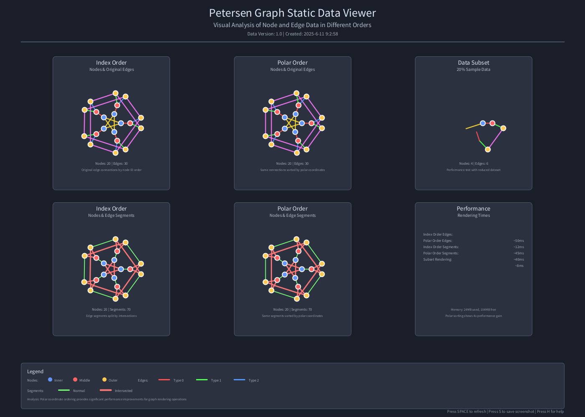

# PetersenGraph

Processing software implementation for visualizing and analyzing the Petersen Graph structure. This project provides accurate mathematical representation of the classic graph theory example with interactive debugging capabilities and data export functionality.

## Features

- Mathematically accurate Petersen Graph visualization with 20 nodes and 30 edges
- Three-layer concentric structure (inner, middle, outer circles)
- Color-coded connection types for visual analysis
- Interactive debug mode with node and edge labeling
- Data export capabilities (JSON and CSV formats)
- Real-time structure validation and statistics

## Documentation

- [Petersen Graph Specification v1.0](PetersenGraphSpecification_1.md) - Complete technical specification with precise coordinates and connection patterns
- [Petersen Graph Specification v0.0](PetersenGraphSpecification_0.md) - Initial specification (deprecated)

## Processing Implementation

### Interactive Petersen Graph Data Processor (petersen_graph_processing.pde)

#### Quick Start

1. Open the project in Processing IDE
2. Run petersen_graph_processing.pde
3. Press 'D' to toggle debug information
4. Press 'P' to print detailed graph data
5. Press 'E' to export data files
6. Press 'S' to export static data
7. Press 'R' to reset view to default state

#### Graph Structure

- **20 Nodes**: 5 middle (red), 5 inner (blue), 10 outer (yellow)
- **30 Edges**: 5 connection types with distinct colors
- **3-Regular Graph**: Each node has exactly 3 connections
- **Non-Planar**: Requires edge crossings in 2D representation

#### Controls

- `D` - Toggle debug display (shows node/edge IDs)
- `P` - Print complete graph data to console
- `E` - Export data to JSON and CSV files
- `O` - Toggle export directory (data/ or exports/)
- `S` - Export static data to JSON
- `I` - Toggle intersection display

### Static Data Viewer (petersen_graph_static_data_viewer.pde)

#### Overview

A simplified viewer that loads and displays pre-computed Petersen Graph data from JSON files. Ideal for presentations and static analysis without real-time calculations.

#### Getting Started

1. Ensure JSON data files are in the `data/` directory
2. Run petersen_graph_static_data_viewer.pde
3. Use keyboard shortcuts to navigate different views
4. Export high-quality PNG images for documentation

#### Key Features

- Load graph structure from JSON data files
- Optimized rendering for high-quality output
- Statistical overlay information
- Performance comparison analysis

#### Static Viewer Controls

- `SPACE` - Refresh display
- `S` - Save screenshot with timestamp
- `H` - Show/hide help overlay

## User Interface

### Main Interface Screenshot

The main interface displays the complete Petersen Graph with its characteristic three-layer structure. The visualization includes color-coded nodes and edges, making it easy to identify different connection patterns and analyze the graph's mathematical properties.
